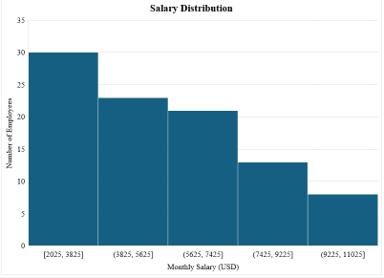
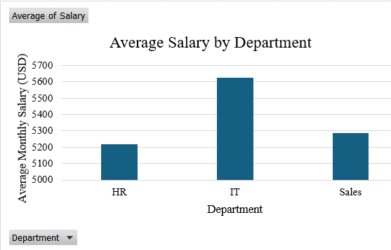
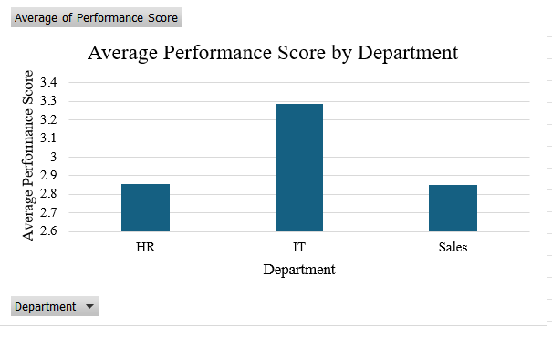

# MIS 311 - Employee Performance Data Analysis

## Overview

This project was completed as part of the **MIS 311 – Introduction to Business Analytics** course at **Eastern International University**.

The objective of this project is to perform **Exploratory Data Analysis (EDA)** on an Employee Performance dataset using Microsoft Excel and Power Query. The analysis aims to clean the data, summarize key statistics, visualize employee information, and generate business insights that support data-driven decision making.

---

## Project Objectives

- Understand the structure of the Employee Performance dataset.
- Clean the dataset by handling missing values and duplicate records.
- Perform descriptive statistical analysis.
- Create meaningful visualizations.
- Generate business insights from employee data.

---

## Dataset Information

The dataset contains employee information from three departments:

- Human Resources (HR)
- Information Technology (IT)
- Sales

### Variables

| Variable | Description |
|----------|-------------|
| ID | Employee ID |
| Name | Employee Name |
| Age | Employee Age |
| Department | Department |
| Salary | Monthly Salary (USD) |
| Performance Score | Employee Performance Rating |
| Experience | Years of Experience |
| Status | Employment Status |
| Location | Office Location |
| Session | Working Session |

---

## Data Cleaning

The following preprocessing steps were completed before analysis:

- Checked data types
- Removed 4 duplicate records
- Identified missing values
- Performed analysis on valid Performance Score records due to a high percentage of missing values
- Prepared a clean dataset for statistical analysis

---

## Descriptive Statistics

The analysis focused on four numerical variables:

- Age
- Salary
- Experience
- Performance Score

Key descriptive statistics include:

- Mean
- Median
- Minimum
- Maximum
- Standard Deviation

---

## Visualizations

Three visualizations were created using Microsoft Excel.

### 1. Salary Distribution

Histogram illustrating the distribution of employee salaries.

### 2. Average Salary by Department

Column chart comparing average monthly salary across departments.

### 3. Average Performance Score by Department

Column chart comparing average employee performance across departments.

---

## Key Insights

### Insight 1

The IT department records both the highest average salary (USD 5,624) and the highest average performance score (3.29), suggesting that technical expertise is strongly associated with organizational performance.

### Insight 2

Higher salaries do not necessarily lead to better employee performance. Although the Sales department earns slightly higher salaries than HR, both departments have almost identical performance scores, indicating that factors beyond compensation influence employee productivity.

---

## Tools Used

- Microsoft Excel
- Power Query
- Pivot Tables
- Pivot Charts
- Descriptive Statistics

